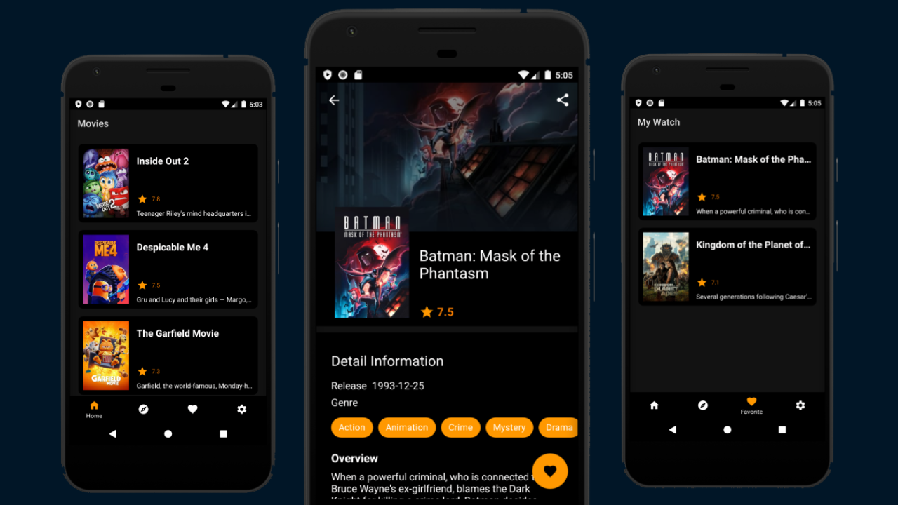

# 📱 Movie App

[](https://kotlinlang.org)
[](https://developer.android.com/studio/releases/gradle-plugin)
[](https://gradle.org)

[](https://circleci.com/gh/amiqyolo/Submission-Final-MADE-Dicoding)

This Android project is a simple application that showcases information about various movies. The data is dynamically sourced from the [TMDB API](https://developers.themoviedb.org/3/getting-started/introduction) cinema platform.

The app features multiple screens across different modules:

- Movie List Screen: Displays a list of movies.
- Movie Detail Screen: Shows detailed information about the selected movie.
- Search Screen: Displays movies found through the search engine.
- Favorites Screen: Lists movies the user saved to watch.
- Settings Screen: Provides access to the app's settings menu.

<p align="center">
  
</p>

## Getting Started

There are a few ways to open this project.

### Android Studio

1. `Android Studio` -> `File` -> `New` -> `Project from Version control` -> `Git`
2. Enter `https://github.com/amiqyolo/Submission-Final-MADE-Dicoding.git` into URL field and press `Clone` button

### Command-line And Android Studio

1. Run `git clone https://github.com/amiqyolo/Submission-Final-MADE-Dicoding.git` command to clone the project
2. Open `Android Studio` and select `File | Open...` from the menu. Select the cloned directory and press `Open` button

### Setup Requirements

First, obtain the data is dynamically sourced from [The Movie Database API](https://developers.themoviedb.org/3/getting-started/introduction). Register on TMDB to get your API key from your account settings page. To get the certificate key, you can use [ssllabs.com/ssltest](https://www.ssllabs.com/ssltest) and copy the key from each certificate in the `Subject - Pin SHA256` section. Add the key to a file named `local.properties` in your project root directory as follows:

```bash
HOSTNAME="api.themoviedb.org"
BASE_URL="https://api.themoviedb.org/3/"
IMAGE_URL="https://image.tmdb.org/t/p/w500"
YOUR_API_KEY="*****"
YOUR_CERTIFICATE_KEY="*****"
```

Then, replace it in the `build.gradle(:core)` :

```bash
buildConfigField "String", "HOSTNAME", "${properties.getProperty("HOSTNAME")}"
buildConfigField "String", "BASE_URL", "${properties.getProperty("BASE_URL")}"
buildConfigField "String", "IMAGE_KEY", "${properties.getProperty("IMAGE_KEY")}"
buildConfigField "String", "API_KEY", "${properties.getProperty("YOUR_API_KEY")}"
buildConfigField "String", "CERTIFICATE_FILE", "${properties.getProperty("YOUR_CERTIFICATE_KEY")}"
```

Finally, rebuild the project to apply the changes. Remember to update the key reference in the `Constants.kt` file in the `core` module."

```bash
const val HOSTNAME = BuildConfig.HOSTNAME
const val BASE_URL = BuildConfig.BASE_URL
const val API_KEY = BuildConfig.API_KEY
const val IMAGE_URL = BuildConfig.IMAGE_URL
const val CERTIFICATE_KEY = BuildConfig.CERTIFICATE_KEY
```

## Tech Stack

This project leverages best practices and popular libraries and tools in the Android ecosystem.

- Clean Architecture
- MVVM Architecture
- Modularization (core module)
- Dynamic Feature (favorite module)
- Dagger2
- RxJava
- Android Jetpack Components
- Retrofit2 + GSON Converter
- OkHttp Logging Interceptor
- Lottie Files
- Shimmer
- Obfuscation Proguard
- Encryption SQLCipher
- Certificate Pinning
- Circle-CI

## Contribute

> PRs are welcome :)